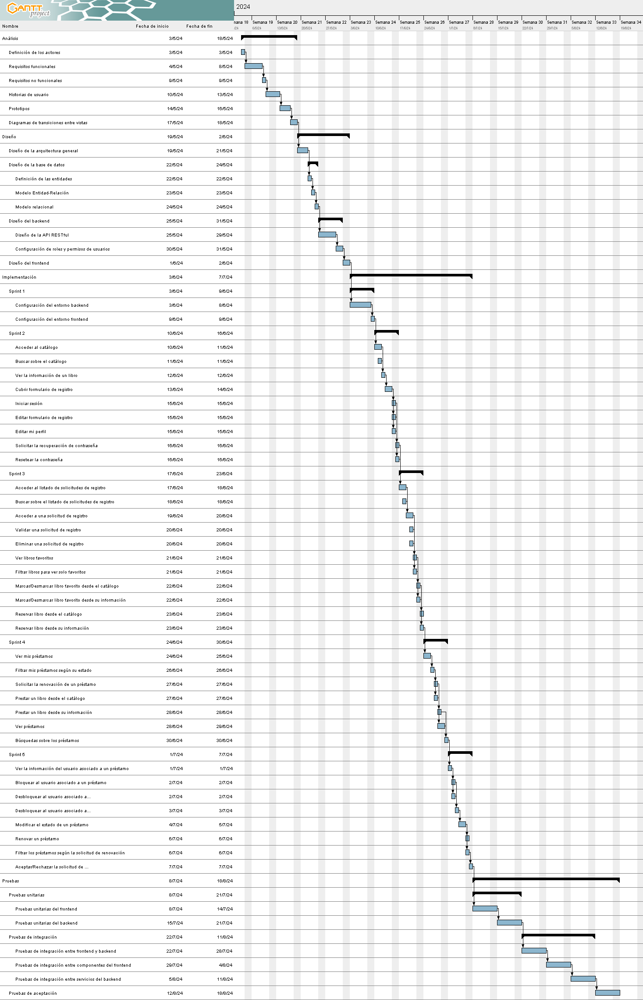

# Desarrollo de una Aplicación Web para la Gestión de Pequeñas Bibliotecas

Este proyecto tiene como objetivo desarrollar una solución web para la gestión diaria de bibliotecas pequeñas, no integradas en redes oficiales. La aplicación está diseñada para ser accesible y fácil de adoptar, facilitando la interacción virtual con los usuarios y optimizando la gestión de recursos bibliotecarios.

## Backend

Este repositorio contiene el backend de la aplicación, construido con Strapi. Strapi actúa como el núcleo de la aplicación, gestionando la lógica de negocio y el almacenamiento de datos. 

### Características de Strapi:

- **Interfaz de Administración**: Permite gestionar el contenido y definir modelos de datos de forma intuitiva.
- **API RESTful**: Strapi expone los datos a través de una API RESTful que puede ser consumida por los clientes de la aplicación.
- **Base de Datos**: Utiliza SQLite por defecto para el almacenamiento de datos, sin necesidad de configuración adicional.

## Requisitos previos

Antes de comenzar, asegúrate de tener instalados los siguientes programas y herramientas en tu sistema:

1. **Node.js** (versión 18.x.x o superior):
   - Node.js es necesario para ejecutar el entorno de JavaScript en el que Strapi funciona.
   - Puedes descargar la última versión desde [aquí](https://nodejs.org/).
   - Verifica si está instalado ejecutando:
     ```bash
     node -v
     ```

2. **npm** (versión 6.x.x o superior):
   - npm es el gestor de paquetes de Node.js, y se instala automáticamente junto con Node.js.
   - Verifica si está instalado ejecutando:
     ```bash
     npm -v
     ```

3. **Base de datos SQLite** (instalación automática):
   - El proyecto utiliza **better-sqlite3** como la base de datos por defecto. No se requiere configuración adicional para SQLite ya que Strapi la instala automáticamente.

4. **Git** (para clonar el repositorio):
   - Necesitas Git para clonar este repositorio en tu máquina local.
   - Descárgalo desde [aquí](https://git-scm.com/downloads).

5. **Cloudinary** (para carga de imágenes):
   - El proyecto utiliza **Cloudinary** como proveedor de almacenamiento para subir y gestionar imágenes.
   - Debes tener una cuenta en **Cloudinary**. Puedes registrarte [aquí](https://cloudinary.com/).
   - Una vez que tengas una cuenta, debes configurar las variables de entorno correspondientes en el archivo `.env` para que Strapi pueda interactuar con tu cuenta de Cloudinary.

## Instalación

Sigue estos pasos para clonar el repositorio, instalar las dependencias y configurar el backend correctamente.

1. **Clona el repositorio:**
   
   Usa Git para clonar el repositorio en tu máquina local:
   ```bash
   git clone https://github.com/MiguelLabrada/biblio_strapi.git
   ```

2. **Accede al directorio del proyecto:**

    Una vez clonado, navega al directorio del proyecto:
    ```bash
    cd biblio_strapi
    ```

3. **Instala las dependencias:**

    Ejecuta el siguiente comando para instalar todas las dependencias necesarias:
    ```bash
    npm install
    ```

4. **Configura las variables de entorno:**

    Crea un archivo .env en el directorio raíz del proyecto, basado en el archivo de ejemplo con las siguientes variables necesarias:
    ```bash
    CLOUDINARY_NAME=your-cloudinary-name
    CLOUDINARY_KEY=your-cloudinary-api-key
    CLOUDINARY_SECRET=your-cloudinary-api-secret
    ```
    Puedes obtener estos valores desde tu cuenta de Cloudinary, en la sección de "Configuración" bajo "API Keys".

5. **Inicia el servidor de desarrollo:**

    Una vez configuradas las variables de entorno, puedes iniciar el servidor de Strapi ejecutando:
    ```bash
    npm run develop
    ```

6. **Accede a la interfaz de administración:**

    Después de ejecutar el servidor, abre tu navegador y navega a:
    ```bash
    http://localhost:1337/admin
    ```
    Aquí podrás crear una cuenta de administrador y empezar a gestionar el contenido de la aplicación.

## Cronograma del Proyecto

Para una visión general del cronograma del proyecto, consulta el Diagrama de Gantt a continuación, que detalla la planificación y las fases del desarrollo:

